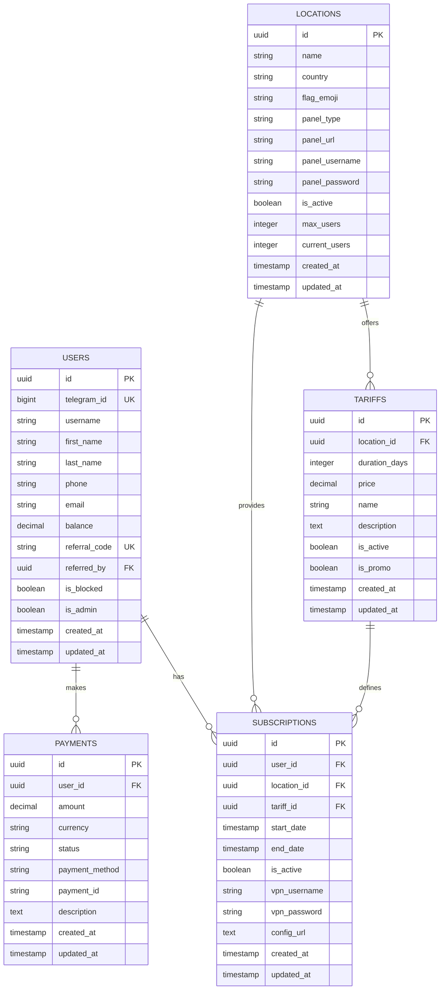

# VPN Telegram Bot - План разработки


## 📋 Обзор проекта

Комплексное решение для автоматизированной продажи VPN подписок через Telegram-бота с веб-панелью администрирования, интеграцией множественных платежных систем и VPN панелей.

### 🎯 Основные цели
- Автоматизация продаж VPN подписок
- Упрощение управления пользователями и серверами
- Интеграция с популярными VPN панелями (3x-ui, Marzban)
- Многоканальная система платежей
- Комплексная система администрирования

## 🏗️ Архитектура системы

```
┌─────────────────┐    ┌─────────────────┐    ┌─────────────────┐
│   Telegram Bot  │    │  Web Admin Panel│    │   VPN Panels    │
│                 │    │                 │    │                 │
│  • aiogram 3.x  │    │  • Vue.js/React │    │  • 3x-ui        │
│  • User Interface│    │  • Admin Tools  │    │  • Marzban      │
└─────────┬───────┘    └─────────┬───────┘    └─────────┬───────┘
          │                      │                      │
          └──────────────────────┼──────────────────────┘
                                 │
                    ┌─────────────▼─────────────┐
                    │      API Backend          │
                    │                           │
                    │  • FastAPI/Django         │
                    │  • Business Logic         │
                    │  • Payment Processing     │
                    └─────────────┬─────────────┘
                                  │
          ┌───────────────────────┼───────────────────────┐
          │                       │                       │
┌─────────▼───────┐    ┌─────────▼───────┐    ┌─────────▼───────┐
│   PostgreSQL    │    │      Redis      │    │ Payment Gateway │
│                 │    │                 │    │                 │
│ • User Data     │    │ • Caching       │    │ • Sever Pay     │
│ • Subscriptions │    │ • Sessions      │    │ • CryptoPay     │
│ • Payments      │    │ • Task Queue    │    │ • XRocket Pay   │
└─────────────────┘    └─────────────────┘    └─────────────────┘
```

## 🚀 Технологический стек

### Backend
- **Python 3.9+** - основной язык разработки
- **FastAPI** - современный веб-фреймворк для API
- **aiogram 3.x** - асинхронная библиотека для Telegram Bot API
- **SQLAlchemy** - ORM для работы с базой данных
- **Alembic** - система миграций базы данных

### База данных и кеширование
- **PostgreSQL 14+** - основная база данных
- **Redis** - кеширование и очередь задач
- **Celery** - обработка фоновых задач

### Frontend (Веб-панель)
- **Vue.js 3** или **React 18** - фронтенд фреймворк
- **TypeScript** - типизированный JavaScript
- **Vite** - сборщик и dev-сервер
- **Tailwind CSS** - utility-first CSS фреймворк

### DevOps и развертывание
- **Docker & Docker Compose** - контейнеризация
- **Nginx** - веб-сервер и reverse proxy
- **Gunicorn** - WSGI HTTP сервер
- **GitHub Actions** - CI/CD pipeline

## 📊 Структура базы данных

### Основные модели данных



## 🎯 Функциональные требования

### 👤 Пользовательский функционал

#### Основное меню
- 🏠 **Главная** - обзор активных подписок и статуса
- 📊 **Мои подписки** - детальная информация о VPN конфигурациях
- 💰 **Баланс** - управление средствами и пополнение
- 🎯 **Тарифы** - каталог доступных подписок
- 📱 **Пробный период** - активация тестового доступа
- 🔗 **Реферальная программа** - приглашение друзей
- 📞 **Поддержка** - техническая помощь

#### Система тарифов
```
📍 Локации:
├── 🇺🇸 США (3 сервера)
├── 🇳🇱 Нидерланды (2 сервера)
├── 🇩🇪 Германия (2 сервера)
└── 🇸🇬 Сингапур (1 сервер)

💎 Тарифные планы:
├── 1 месяц - 49 ₽
├── 3 месяца - 129 ₽ (скидка 11%)
├── 6 месяцев - 249 ₽ (скидка 16%)
└── Навсегда - 599 ₽ (скидка 20%)
```

### 🔧 Административный функционал

#### Панель управления
- 📊 **Dashboard** - ключевые метрики и статистика
- 👥 **Пользователи** - управление клиентами
- 🖥️ **Серверы** - мониторинг и настройка VPN панелей
- 💰 **Финансы** - платежи, балансы, отчеты
- 🎫 **Поддержка** - система тикетов
- 📤 **Рассылки** - массовые уведомления
- ⚙️ **Настройки** - конфигурация системы

## 🔌 Интеграции

### VPN Панели

#### 3x-ui Integration
```python
class ThreeXUIClient:
    async def create_client(self, user_data: dict) -> dict
    async def delete_client(self, client_id: str) -> bool
    async def get_client_stats(self, client_id: str) -> dict
    async def reset_client_traffic(self, client_id: str) -> bool
```

#### Marzban Integration
```python
class MarzbanClient:
    async def create_user(self, user_data: dict) -> dict
    async def delete_user(self, username: str) -> bool
    async def get_user_usage(self, username: str) -> dict
    async def modify_user(self, username: str, **kwargs) -> bool
```

### Платежные системы

#### Поддерживаемые провайдеры
- 💳 **Sever Pay** - банковские карты, электронные кошельки
- 🪙 **CryptoPay** - криптовалютные платежи (BTC, ETH, USDT)
- 🚀 **XRocket Pay** - Telegram-интегрированные платежи

## 📅 План разработки

### 🔧 Фаза 1: Основа (2-3 недели)
- [x] Настройка инфраструктуры разработки
- [x] Базовая архитектура и модели данных
- [x] Telegram бот с основным функционалом
- [x] Интеграция с одной VPN панелью (3x-ui)
- [x] Простая система платежей (Sever Pay)
- [x] Docker контейнеризация

### 🎨 Фаза 2: Расширение (2-3 недели)
- [ ] Полный функционал пользовательского меню
- [ ] Реферальная система и программа лояльности
- [ ] Веб-панель администрирования (MVP)
- [ ] Интеграция с Marzban
- [ ] Система поддержки и тикеты
- [ ] Расширенная аналитика

### 🚀 Фаза 3: Продвинутые функции (1-2 недели)
- [ ] Полнофункциональная веб-панель
- [ ] Дополнительные платежные системы
- [ ] Система массовых рассылок
- [ ] Мониторинг и алерты
- [ ] API документация
- [ ] Юнит и интеграционные тесты

### 🎯 Фаза 4: Продакшн (1 неделя)
- [ ] Финальное тестирование и отладка
- [ ] Оптимизация производительности
- [ ] Настройка мониторинга продакшн
- [ ] Развертывание на сервере
- [ ] Создание документации пользователя

## 📈 Ключевые метрики

### Производительность
- ⚡ Время ответа API: < 500ms
- 📊 Обработка: до 1000 одновременных пользователей
- 🕐 Uptime: 99.5%
- 🔄 Время отклика бота: < 3 секунды

### Безопасность
- 🔐 Шифрование данных в покое и передаче
- 🛡️ Rate limiting для защиты от DDoS
- 🔍 Валидация и санитизация входящих данных
- 📝 Комплексное логирование безопасности

## 🚀 Начало работы

### Локальная разработка

1. **Клонирование репозитория**
```bash
git clone https://github.com/your-username/vpn-telegram-bot.git
cd vpn-telegram-bot
```

2. **Настройка окружения**
```bash
cp .env.example .env
# Отредактируйте .env с вашими настройками
```

3. **Запуск с Docker**
```bash
docker-compose up -d
```

4. **Инициализация базы данных**
```bash
docker-compose exec api alembic upgrade head
```

### Переменные окружения

```bash
# Telegram Bot
TELEGRAM_BOT_TOKEN=your_bot_token
TELEGRAM_WEBHOOK_URL=https://your-domain.com/webhook

# Database
DATABASE_URL=postgresql://user:password@db:5432/vpn_bot
REDIS_URL=redis://redis:6379

# Payment Systems
SEVER_PAY_API_KEY=your_sever_pay_key
CRYPTO_PAY_TOKEN=your_crypto_pay_token
XROCKET_PAY_KEY=your_xrocket_key

# VPN Panels
THREE_XUI_PANELS=panel1_url,panel2_url
MARZBAN_PANELS=marzban1_url,marzban2_url

# Security
SECRET_KEY=your-secret-key
JWT_SECRET_KEY=your-jwt-secret
```

## 📝 API Документация

### Основные эндпоинты

```yaml
/api/v1/
├── auth/
│   ├── login
│   └── logout
├── users/
│   ├── profile
│   ├── subscriptions
│   └── payments
├── admin/
│   ├── dashboard
│   ├── users
│   ├── servers
│   └── payments
└── webhooks/
    ├── telegram
    └── payments
```

## 🛠️ Развертывание

### Продакшн конфигурация

```yaml
# docker-compose.prod.yml
version: '3.8'
services:
  nginx:
    image: nginx:alpine
    ports:
      - "80:80"
      - "443:443"
    volumes:
      - ./nginx.conf:/etc/nginx/nginx.conf
      - ./ssl:/etc/nginx/ssl

  api:
    build: .
    environment:
      - ENV=production
    depends_on:
      - db
      - redis

  bot:
    build: .
    command: python -m bot.main
    depends_on:
      - api

  db:
    image: postgres:14
    environment:
      POSTGRES_DB: vpn_bot
      POSTGRES_USER: ${DB_USER}
      POSTGRES_PASSWORD: ${DB_PASSWORD}
    volumes:
      - postgres_data:/var/lib/postgresql/data

  redis:
    image: redis:alpine
    volumes:
      - redis_data:/data
```

## 🔍 Мониторинг и логирование

### Метрики
- 📊 Grafana Dashboard для визуализации
- 🔢 Prometheus для сбора метрик
- 📝 Structured logging (JSON формат)
- 🚨 Alerting через Telegram/Email

### Ключевые события
- Регистрации пользователей
- Успешные/неуспешные платежи
- Создание/удаление VPN конфигураций
- Ошибки интеграций

## 🤝 Вклад в проект

1. Fork проекта
2. Создайте feature branch (`git checkout -b feature/amazing-feature`)
3. Commit изменения (`git commit -m 'Add amazing feature'`)
4. Push в branch (`git push origin feature/amazing-feature`)
5. Откройте Pull Request

### Стандарты кода
- Следуйте PEP 8 для Python кода
- Используйте pre-commit хуки
- Покрытие тестами > 80%
- Документируйте публичные методы

## 📄 Лицензия

Этот проект лицензирован под MIT License - см. файл [LICENSE](LICENSE) для деталей.

## 📞 Поддержка

- 📧 Email: support@example.com
- 💬 Telegram: [@support_bot](https://t.me/support_bot)
- 🐛 Issues: [GitHub Issues](https://github.com/your-username/vpn-telegram-bot/issues)

## 💰 Стоимость и сроки

| Этап | Длительность | Стоимость | Описание |
|------|-------------|-----------|----------|
| Фаза 1 | 2-3 недели | $1,500 | Базовый функционал |
| Фаза 2 | 2-3 недели | $1,500 | Расширенные функции |
| Фаза 3 | 1-2 недели | $1,000 | Веб-панель и интеграции |
| Фаза 4 | 1 неделя | $500 | Продакшн готовность |
| **Всего** | **6-8 недель** | **$4,500** | **Полное решение** |

---

<div align="center">
  <strong>🚀 Готовы начать разработку? Свяжитесь с нами!</strong>
</div>
